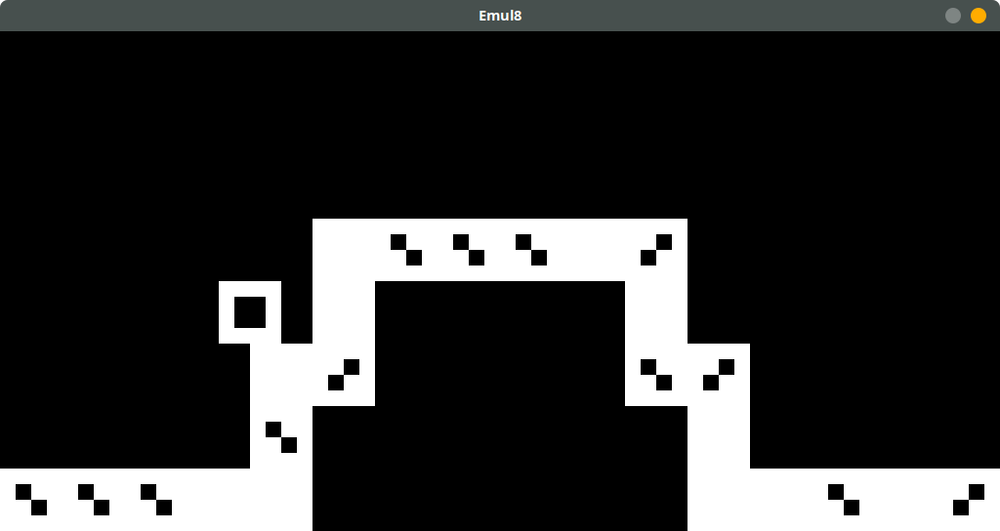

# Emul8

Emul8 is a CHIP-8 emulator written in terse-yet-idiomatic Rust.
It is a reincarnation of an older project of mine, [Emul8or](https://github.com/zesterer/emul8or), a project that I am no longer happy to point to as my sole attempt at emulator development.

# Running

`emul8 <binary file>`

For example,

`emul8 test/test.ch8`

# Debugging

Emul8 also has primitive debugging tools. Use the `--debug` flat to enable them. These include:

- Displaying the instruction currently executed both in opcode and human-readable form

- Pausing the emulator by pressing `P`

- Displaying register values by pressing `R`

- Displaying values in memory by pressing `M`
